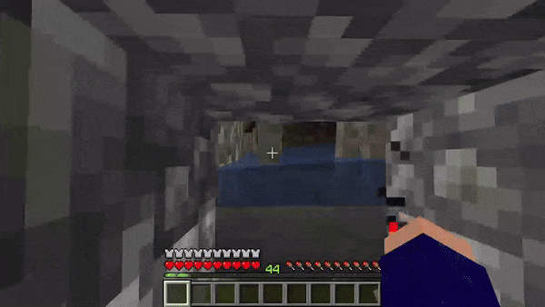

<h1 align="center"> ⛏️ Minecraft Bots ⛏️ </h1>

Scripts made in Python to automate repetitive and boring tasks in Minecraft. You can start all of them pressing ",". They use:

- PyAutoGUI: to control the mouse and keyboard;
- Keyboard: to create event listeners for keyboard inputs.

## 👷‍♂️ Gravel to Flint

Build a pile of gravel and then tear it down to get flint. Press "," to switch between the two modes and press "." to end the script.

## 🦴 Skeleton Faming

Hit skeletons while AFK in a skeleton spawner dungeon. Press "." to end the script.

## 🐺 Bringing Wolves

Cross a body of water slowly to bring wolves along with you to your base. Press "." to end the script.

